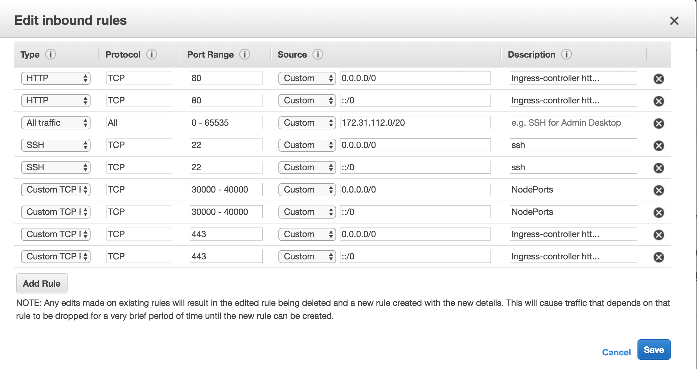

Exercise 3 of session 3: 
Pedro Ignacio Respaldiza Hidalgo (aka Iñaki Respaldiza)
K8s Training user: pedro_respaldiza
---
I had not enough time to prove  the cluster. I preferred to looking for ways to answer all requirements. I will still working in the exercise when I find and solve some issue, I will commit to the corrections.

## AWS
In order to carry out this project, I have generated the following infrastructure:
### Instances
I launched four instances: Two controller, which also house the etc, and two workers.
### Security Goup

Because the lack of time I have only created a security group. Controllers should not have open ports between 30000-40000 while workers do not need to open ports 80 and 443.
Within the subnet, all ports are available, although in a real  configuration unnecesary ports would be restricted.
### IP Considerations
If we want to have high availability it is necessary to have replicas of the infrastructures and a load balancer that distributes among the API controllers.
For this proof of concept I thought it unnecessary to create a load balancer. To simulate the use, I have created an Elastic IP that allows me to use an immutable IP in the generation of certificates, and I can remap it for the tests and could eventually be redirected to a balancer.
## Other 
### Calico 

## Process
This is the list of all the necessary scripts with a brief explanation of their function. After the name, in parentheses, indicate the machine where have to run. At all times, administration privileges are assumed on the servers.
- 01-cluster-auth.bash (Conroller0)
> Generate the cluster CA certeificate in controller0. 
- 02-etcd-controller0.bash (controller0)
> Generate the etcd certificate and install it in controller0
- 03-etcd-controller1.bash (controller1)
> Generate certificate for etcd in controller 1
- 04-etcd-comtroller1.bash (controller0)
> Sing the certificate
- 05-etcd-controller1.bash (controller1)
> Install etcd controller1
- 06-controller0-kube-apiserver.bash (controller0)
> Certificate and install the Kubernetes Api Server in controller 0
- 07-controller1-kube-apiserver.bash (controller1)
> Create certificate for controller 1
- 08-controller1-kube-apiserver.bash (controller0)
> Sing the certificate
- 09-controller1-kube-apiserver.bash (controller1)
> Install apiserver in controller 1
- 10-admin-kubeconfig.bash (client)
> Generate Certificate
- 11-admin-kubeconfig.bash (controller0)
> Sing the certificate
- 12-admin-kubeconfig.bash (client)
> Create contex and install it
- 13-kube-controller0 (controller0)
> Install Kube Controller Manager in controller 0
- 14-kube-controller1 (controller1)
> Generate certificate
- 15-kube-controller1 (controller0)
> Sing certificate
- 16-kube-controller1 (controller1)
> Install Kube Controller Manager
- 17-kube-sheduler.bash (controller0)
> Install kube-sheduler in controller 0
- 18-kube-sheduler.bash (controller1)
> Generate certificate
- 19-kube-sheduler.bash (controller0)
> Sign certificate
- 20-kube-sheduler.bash (controller1)
> Install Kube Sheduler in controller 1
- 21-kubelet.bash (worker0, worker1)
> Generate certificate
- 22-kubelet.bash (controller0)
> Sing certificate
- 23-kubelet.bash (worker0, worker1)
> Install kubelet and dependencies
- 24-network.bash ()
> Deploy calico daemonset
- 25-kube-proxy.bash (worker0, worker1)
> Generate certificate 
- 26-kube-proxy.bash (controller0)
> Sing certificate
- 27-kube-proxy.bash (worker0, worker1)
> Install Kube Proxy
- 28-tiller.bash (client)
> Install tiller for use HELM
- 29-nfs-provisioner (worker0, worker1)
> Install nfs-common
- 30-nfs-provisioner (client)
> Install nfs provisioner
- 31-kube-dns.bash
> Deploy Kube DNS
- 32-traefik.bash
> Deploy traefik like ingress controller
- 33-dashboard.bash
> Install Kubernetes Dashboard
